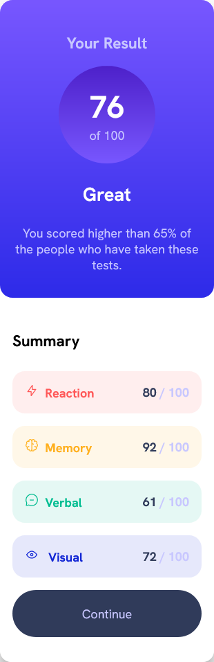
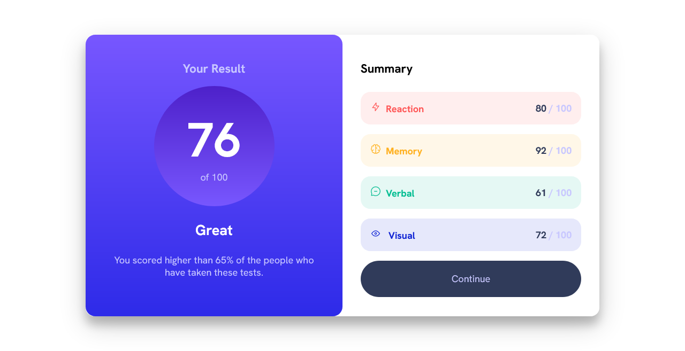
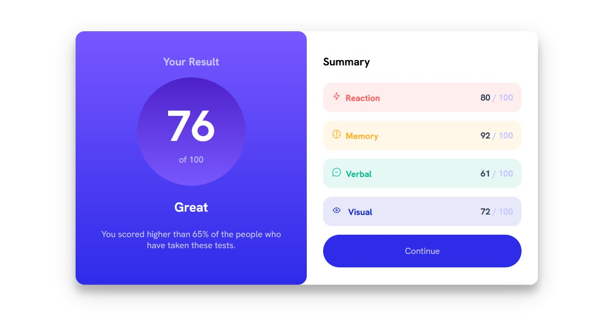

# Frontend Mentor - Results summary component solution

This is a solution to the [Results summary component challenge on Frontend Mentor](https://www.frontendmentor.io/challenges/results-summary-component-CE_K6s0maV).

## Table of contents

- [Overview](#overview)
  - [The challenge](#the-challenge)
  - [Screenshot](#screenshot)
  - [Links](#links)
- [My process](#my-process)
  - [Built with](#built-with)
  - [What I learned](#what-i-learned)
- [Author](#author)

## Overview

### The challenge

Users should be able to:

- View the optimal layout for the interface depending on their device's screen size
- See hover and focus states for all interactive elements on the page
- **Bonus**: Use the local JSON data to dynamically populate the content

### Screenshot

#### Mobile View

#### Desktop View

#### Active State

### Links

- [Github repo](https://github.com/nurmarief/fementor_results-summary-component)
- [Live site](https://nur-m-arief-k.github.io/fementor_results-summary-component/)

## My process

### Built with

- Semantic HTML5 markup
- Flexbox
- CSS Grid
  BEM Architecture for CSS
- Mobile-first workflow

### What I learned

In this challenge, I mainly learn about BEM Architecture priciples for CSS:

1. only use class selector for styling,
2. avoid using complex selectors to prevent unexpected behavior because CSS specificity,
3. split css into blocks or components,
4. organizing CSS files by blocks,

## Author

- [@nurmarief](https://www.frontendmentor.io/profile/nurmarief)
